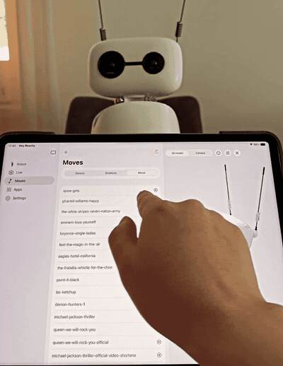

# reachy-mini-swift


**Hey Reachy** — a native macOS / iPadOS / iOS client for the **Reachy Mini** robots by
[Pollen Robotics](https://www.pollen-robotics.com): the Wireless model, a Lite one plugged into a computer, a daemon
run in simulation — or no robot at all, with the simulator the app carries itself.

<br clear="left" />

[](https://github.com/alexey1312/reachy-mini-swift/actions/workflows/ci.yml)
[](https://apps.apple.com/app/hey-reachy/id6799644194)
[](https://testflight.apple.com/join/CGjefT9a)

<p align="center">
  <a href="https://alexey1312.github.io/reachy-mini-swift/">
    
  </a>
</p>

The app's own page — what it does, screenshots, privacy and support — is at
**[alexey1312.github.io/reachy-mini-swift](https://alexey1312.github.io/reachy-mini-swift/)**. This README is the
developer side of the same project.

> [!NOTE]
> Unofficial project, not affiliated with Pollen Robotics. This is **not a fork** of the official
> [desktop app](https://github.com/pollen-robotics/reachy-mini-desktop-app) — it is an independent Swift client for
> the robot daemon's documented HTTP/WebSocket API. The upstream repositories are used as a behavioral specification,
> not as a source of code.

## What it does

- **Connect** — Bonjour discovery, typed addresses, IPv6 and automatic reconnect. A robot is identified by hardware
  id, never by address. Three ways in: the local network, the Hugging Face relay, or the simulator.
- **A robot that is not there** — a simulator inside the app, on every platform, with no daemon, no network and no
  Python. It declines what it cannot honestly answer instead of lying.
- **Live control** — joystick teleop of the 6-DoF head, antennas and body rotation, with the WebRTC camera and
  two-way audio.
- **3D viewer** — a RealityKit scene built from the robot's own URDF and meshes, mirroring it in real time.
- **State** — the daemon's control loop charted live, beside CPU, memory, temperature and uptime read over SSH.
- **Moves and sounds** — play the daemon's recorded moves, record your own takes from the phone, and drive a
  soundboard for the robot's speaker.
- **App store** — install, update and remove robot apps from Hugging Face Spaces, following each job over the
  daemon's job socket.
- **Bluetooth setup** — PIN-authenticated onboarding that sends Wi-Fi credentials over an encrypted BLE channel,
  plus a recovery console for a robot that fell off the network.
- **Remote access** — reach a robot from outside its network through the Hugging Face relay. The daemon's port is
  never exposed.
- **Files** — an SFTP browser for the robot's filesystem.
- **At home on Apple platforms** — widgets on the Home Screen, Lock Screen and StandBy, the Mac menu bar, Control
  Center controls, Siri, Spotlight, six themes, and five languages.

## Try it

<p align="center">
  <a href="https://apps.apple.com/app/hey-reachy/id6799644194">
    
  </a>
  <a href="https://testflight.apple.com/join/CGjefT9a">
    
  </a>
</p>

The Mac version is on the App Store. iPhone and iPad are in review, and until they land the TestFlight link is the
way in — one link for all three. Minimum iOS 18 and macOS 15. Each
[release](https://github.com/alexey1312/reachy-mini-swift/releases) also carries a notarized Mac zip, signed with a
Developer ID.

**A robot is no longer the price of admission.** Every tab is still behind a live session, but the connect screen's
third segment starts one against the simulator the app carries.

Feedback goes through TestFlight or as an [issue](https://github.com/alexey1312/reachy-mini-swift/issues). The
Bluetooth onboarding path is the one worth breaking first — see [Status](#status). Privacy:
[nothing is collected](docs/privacy.md).

## Scope

- **A robot with no daemon at all.** `ReachySimulator` carries upstream's own description and meshes, `StewartIK` for
  the head, and the slew limiter the app puts on what it sends a real robot. Apps, sounds, the daemon journal, Wi-Fi,
  updates and the camera belong to a machine that is not there, so every screen behind them reports itself
  unavailable.
- **Any reachable daemon, and this app never starts one.** The Wireless model runs the daemon itself
  (`http://reachy-mini.local:8000`); a Lite robot and the simulator run the same daemon on a computer, with
  `--serialport` or `--sim`. Installing or launching that daemon means shipping a Python environment, which the Mac
  App Store does not allow and iOS cannot run.
  - A daemon on another computer is reachable **only if it was given `--fastapi-host 0.0.0.0`**. The default outside
    `--wireless-version` is `127.0.0.1`, which binds loopback alone.
  - **Lite is not the Wireless experience minus the battery.** `/wifi/*`, `/update/*`, `/cache/*` and the journal are
    mounted only under `--wireless-version`, so a Lite robot answers 404 to each and the app hides those cards.
    Upstream has not reworked the daemon for Lite yet, so treat this half as moving ground.
- **Camera is WebRTC-only.** The daemon exposes no MJPEG endpoint.

## Architecture

| Package           | What                                                                                                                 |
| ----------------- | -------------------------------------------------------------------------------------------------------------------- |
| `ReachyKit`       | Generated OpenAPI client, WebSocket state stream, discovery, BLE provisioning, URDF and kinematics. No UI framework. |
| `ReachyMedia`     | WebRTC camera and two-way audio session, plus its video view.                                                        |
| `ReachyScene`     | RealityKit scene built from the robot's own URDF and meshes.                                                         |
| `ReachySimulator` | A robot that is not there: upstream's description and meshes, a pose loop, and a state stream a session believes.    |
| `ReachyUI`        | The screens: connect gate, five-tab shell, teleop, state, store, files, onboarding, recovery, settings.              |
| `ReachyDesign`    | Design tokens and the surface facade — SwiftUI and nothing else, linked by every UI layer.                           |
| `ReachyWidgetUI`  | Widget views and the App Intents the app and the widget extension share. Depends on `ReachyKit` alone — no WebRTC.   |
| `ReachySSH`       | SFTP via Citadel. Knows nothing about robots; host, port and credentials arrive as values.                           |
| `HuggingFaceAuth` | The app's own Hugging Face session: OAuth sign-in, Keychain storage, renewal. Knows nothing about robots.            |
| `Apps/`           | Thin app shells and the widget extension, generated with [Tuist](https://tuist.dev).                                 |

`ReachyKit` sits at the bottom with no UI, `ReachyUI` composes everything, and `ReachyDesign` depends on nothing at
all. `ReachyWidgetUI` never links WebRTC — a widget process woken for a moment cannot afford it — and `ReachySSH`
sits beside `ReachyKit` for the same reason. `ReachyJSON` is the single JSON codec every target encodes through
([ADR 0004](docs/adr/0004-one-json-codec.md)).

All nine packages are public SPM products, so another app can depend on them directly. `ReachyKit` is the only one a
robot strictly needs, and the only one that pulls in no UI framework:

```swift
.package(url: "https://github.com/alexey1312/reachy-mini-swift.git", branch: "main"),
```

## Getting started

```bash
./bootstrap.sh
```

That's it — one script installs all pinned tools via a self-contained [mise](https://mise.jdx.dev) binary (`bin/mise`)
and wires git hooks. Swift itself is managed by [swiftly](https://www.swift.org/swiftly/) via `.swift-version`.

```bash
./bin/mise run build        # build the Swift packages
./bin/mise run test         # run the test suites
./bin/mise run build:app    # build the app itself (macOS)
./bin/mise run device       # build, install and launch on a connected iPhone
./bin/mise run sim-daemon   # run a simulated robot daemon (MuJoCo) — no hardware needed
./bin/mise tasks            # list everything else
```

`device` needs a one-time signing setup: put your team id in `~/.config/reachy-mini/device.env` — the script tells
you how on first run.

## Development without hardware

Two different things, and which one you want depends on what you are working on:

- **The app's own simulator** — the `Simulator` segment on the connect screen. No daemon, no network, no Python, and
  the only one of the two that runs on a phone. Use it for the UI, the 3D viewer and the kinematics.
- **A real daemon in MuJoCo simulation** — `./bin/mise run sim-daemon`; the tested daemon baseline is **1.9.0**. Use
  it for anything about the _protocol_: it is upstream's own code answering. The daemon's OpenAPI spec is committed
  at `Sources/ReachyKit/openapi.json` and refreshed with `./bin/mise run update-spec`.

## Testing

- `./bin/mise run test` — the SwiftPM suites: transport, session, models, JSON codec, BLE protocol, SSH, auth.
- `./bin/mise run test:snapshots` — every SwiftUI preview rendered on a pinned simulator and compared against ~1400
  reference images, stored in Git LFS. The approach is [ADR 0002](docs/adr/0002-preview-driven-snapshot-testing.md).
- `./bin/mise run storybook` — the same previews as a browsable catalogue on a simulator.
- `./bin/mise run test:sim` — integration tests against a running `sim-daemon`; the plain `test` run skips them.

## Compatibility and network security

Daemon 1.9.0 is the minimum tested version. Newer 1.x daemons connect with a compatibility warning; older or
different-major versions are rejected before commands are sent
([ADR 0001](docs/adr/0001-daemon-compatibility-and-lan-security.md)).

> [!WARNING]
> The daemon provides **no authentication or encryption**. Use this client only on a trusted private LAN or the
> robot's own access point. Never expose daemon port 8000 through port forwarding or a public address.

Reaching a robot from outside its network does not change that. The Hugging Face relay brokers a WebRTC session
between two peers that authenticated with the same account, and commands travel on that data channel
([ADR 0003](docs/adr/0003-remote-access-over-the-hugging-face-relay.md)).

## Status

Everything listed above works today against a Wireless robot, a Lite one, a simulated daemon or the app's own
simulator. Open, and stated honestly:

- **The Bluetooth provisioning path has not run against real hardware yet.** It is written against daemon 1.9.0's
  `bluetooth_service.py` — including the encrypted Wi-Fi join (X25519 + HKDF-SHA256 + AES-GCM) — and verified
  against stubs. Only the scan has met a robot. The full hardware checklist is
  [docs/research/ble-provisioning.md](docs/research/ble-provisioning.md), and the GATT protocol is not published
  upstream, so treat it as unstable.
- The Stewart platform's passive joints are computed client-side for the 3D view — the daemon reports them only
  under the Placo kinematics engine.
- A remote session carries commands and the camera but not the 3D scene, whose URDF and STL are HTTP-only.
- **The Lite model is reachable, not finished.** Nothing here has met one: the flavour, the absent settings and the
  caption they carry are written against the daemon's own flags and verified against `sim-daemon`.

Background research lives in [docs/research/](docs/research/), accepted decisions in [docs/adr/](docs/adr/).

## Releases

Tags are bare semver (`0.1.0`); each publishes a GitHub Release with notes generated by
[git-cliff](https://git-cliff.org). Signing credentials never enter the repository or CI. The whole procedure is in
[docs/release.md](docs/release.md).

## License

[Apache 2.0](LICENSE). [NOTICE](NOTICE) carries the attribution, the non-affiliation statement and the third-party
notices for the bundled dependencies (Apple's swift-openapi packages, Apache 2.0; Google WebRTC, BSD 3-Clause).
"Reachy Mini" is a product name of Pollen Robotics, used here solely to describe compatibility.
