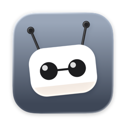
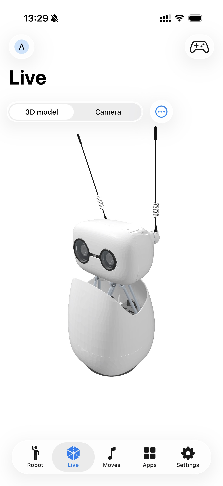
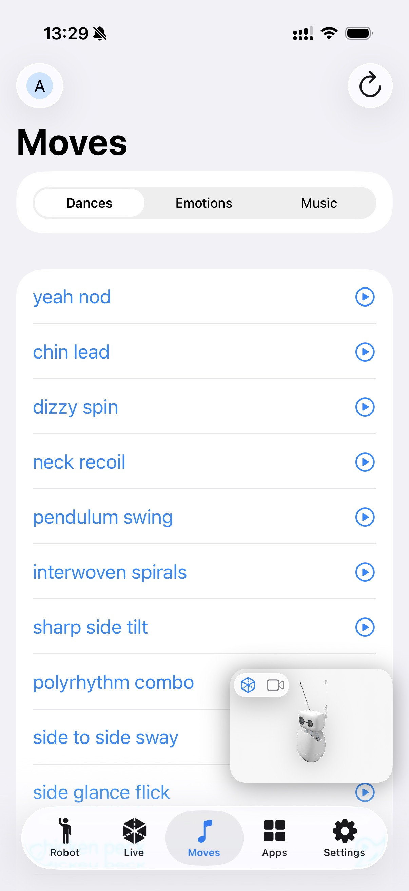
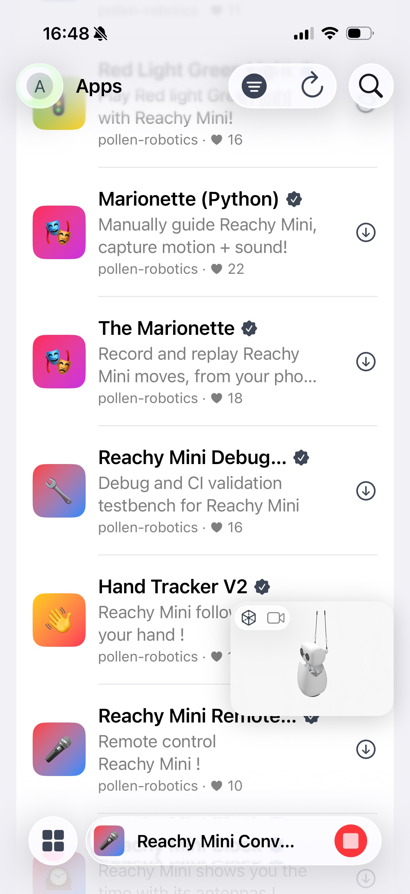
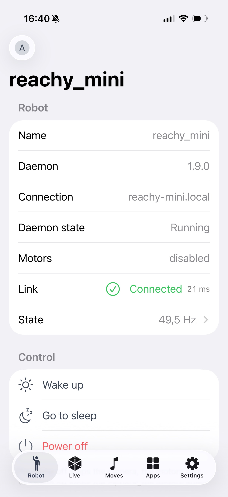

# reachy-mini-swift



**Hey Reachy** — a native macOS / iPadOS / iOS client for the **Reachy Mini** robots by
[Pollen Robotics](https://www.pollen-robotics.com): the Wireless model, a Lite one plugged into a computer, a daemon
run in simulation — or no robot at all, with the simulator the app carries itself.

<br clear="left" />

[](https://github.com/alexey1312/reachy-mini-swift/actions/workflows/ci.yml)
[](https://apps.apple.com/app/hey-reachy/id6799644194)
[](https://testflight.apple.com/join/CGjefT9a)

The app's own page — what it does, screenshots, privacy and support — is at
**[alexey1312.github.io/reachy-mini-swift](https://alexey1312.github.io/reachy-mini-swift/)**. This README is the
developer side of the same project.

> [!NOTE]
> Unofficial project, not affiliated with Pollen Robotics. This is **not a fork** of the official
> [desktop app](https://github.com/pollen-robotics/reachy-mini-desktop-app) — it is an independent Swift client for
> the robot daemon's documented HTTP/WebSocket API. The upstream repositories are used as a behavioral specification,
> not as a source of code.

## Highlights

- **Connect and discover** — Bonjour discovery, typed addresses, IPv6, automatic reconnect; robots are identified by
  hardware id, never by IP. One connect screen with three ways in: **Local** (the sweep, Bonjour and an address you
  type — plus, on a Mac, the daemon running on this very computer), **HF** (your robots through the Hugging Face
  relay) and **Simulator**.
- **A robot that is not there** — a simulator inside the app, on every platform, with no daemon, no network and no
  Python: the robot's own description drawn and driven by the same kinematics the client uses for a real one. The
  joystick moves it and the 3D model follows. It has no camera, no app store and no Wi-Fi, because those belong to a
  machine that does not exist.
- **Live control** — joystick teleop of the 6-DoF head, antennas and body rotation, with the WebRTC camera and
  two-way audio (talk through the robot's speaker); the speaker, the microphone and the robot's own wobbling and
  face tracking are a sheet away from the viewport.
- **3D viewer** — a RealityKit scene built from the robot's own URDF and meshes, mirroring it in real time.
- **State** — the control loop the daemon publishes (frequency, worst interval, error count) charted live, beside
  CPU, memory, temperature and uptime read from `/proc` and `/sys` over SSH, because the API reports none of them.
- **Moves** — browse and play the daemon's recorded moves, from the app or by asking Siri for one by name, and
  record your own takes from the phone — teleop the robot, then play the take back over the same wire path.
- **Sounds** — a soundboard for the robot's speaker. The library is durable on the device and the robot is a cache in
  front of it: uploads live in the daemon's `/tmp`, so a play sends the file first whenever the robot is not known to
  hold it, and a restart that empties the robot costs nothing.
- **App store** — install, update and remove robot apps from Hugging Face Spaces, following each job over the
  daemon's job socket; filter the catalogue by scope, sort it six ways and pin the apps you actually use. A dock
  shows the running app everywhere in the client, and mutes or interrupts the conversation app from there. Starting
  an app wakes the robot first and parks it when the app lets go, and the catalogue and the move index survive
  launches, so both tabs open filled before the network answers.
- **Bluetooth setup and recovery** — PIN-authenticated onboarding that sends Wi-Fi credentials over an encrypted BLE
  channel, plus a recovery console (raise the hotspot, restart the daemon, software reset) for a robot that fell off
  the network.
- **Remote access** — reach your robots from outside their network through the Hugging Face relay; commands travel on
  a brokered WebRTC data channel, the daemon's port is never exposed.
- **Files** — an SFTP browser for the robot's filesystem.
- **At home on Apple platforms** — status and apps widgets on the Home Screen, and the status one on the Lock Screen
  and in StandBy as well; wake and sleep from the widget itself; Control Center controls for power, for a move or an
  app you pick yourself, for a sound, and for stopping whatever is running, each reaching the Lock Screen and the
  Action button too; Siri / App Intents (wake, sleep, power off, launch any installed app, play a recorded move, and
  ask whether the robot is awake or what is running on it), each of which can name the robot it addresses, so two
  Reachys on one desk are told apart; the app's destinations in Spotlight; Home Screen quick actions; German,
  Spanish, French and Russian beside English.
- **Six themes** — an accent colour and a matching app icon chosen as one decision in Settings, carried into the
  widgets too. On iPhone and iPad the Home Screen icon changes with it; on a Mac the theme is colour only.

<p align="center">
  
  
  
  
</p>

_A one-minute demo video from a live robot is on its way._

## Try it

<p align="center">
  <a href="https://apps.apple.com/app/hey-reachy/id6799644194">
    
  </a>
  <a href="https://testflight.apple.com/join/CGjefT9a">
    
  </a>
</p>

The Mac version is on the App Store. iPhone and iPad are in review, and until they land the TestFlight link is the
way in — one link for all three, installing needs Apple's TestFlight app. Minimum iOS 18 and macOS 15.

**A robot is no longer the price of admission.** Every tab is still behind a live session, but the connect screen's
third segment starts one against a simulator the app carries: the robot's own geometry, moved by the same
kinematics, with nothing to install. A **Reachy Mini Wireless** on your network is what the whole app is for; a
**Lite** one — or a daemon run in simulation on a computer — connects too, minus the routes only the wireless daemon
mounts (see [Scope](#scope)). The app's [own page](https://alexey1312.github.io/reachy-mini-swift/) says the same
thing without the build instructions, and carries the
[support notes](https://alexey1312.github.io/reachy-mini-swift/support.html).

The Mac also ships outside the App Store: each [release](https://github.com/alexey1312/reachy-mini-swift/releases)
carries a notarized zip, signed with a Developer ID.

Feedback goes through TestFlight (a screenshot in the app, or the Send Beta Feedback button) or as an
[issue](https://github.com/alexey1312/reachy-mini-swift/issues). The Bluetooth onboarding path is the one worth
breaking first — see [Status](#status) for why. Privacy: [nothing is collected](docs/privacy.md).

## Scope

- **A robot with no daemon at all.** `ReachySimulator` is a robot carried inside the client: upstream's own
  description and meshes, `StewartIK` for the head, the same slew limiter the app puts on what it sends a real
  robot, and a state stream a session cannot tell from a socket. It exists so the app can be used, previewed and
  demonstrated with no hardware and no Python anywhere — and it declines what it cannot honestly answer. Apps,
  sounds, the daemon journal, Wi-Fi, updates and the camera all belong to a machine that is not there, so it
  conforms to none of their protocols and every screen behind them reports itself unavailable rather than lying.
- **Any reachable daemon, and this app never starts one.** On the Wireless model the daemon runs on the robot itself
  (`http://reachy-mini.local:8000`); on the Lite model, and for the simulator, it is the same daemon run on a computer
  — `--serialport` for the robot wired to it, `--sim` for no robot at all. All three speak the same HTTP API, so all
  three connect, and macOS offers the one on this computer as a row of its own. What this app does not do is install
  or launch that daemon the way Pollen's desktop app does: that means shipping a Python environment, which the Mac App
  Store does not allow and iOS cannot run.
  - A daemon started on another computer is reachable **only if it was given `--fastapi-host 0.0.0.0`**. The default
    outside `--wireless-version` is `127.0.0.1`, which binds loopback alone — a phone on the same Wi-Fi is refused by
    that computer's kernel before the daemon is ever reached.
  - **Lite is not the Wireless experience minus the battery.** `/wifi/*`, `/update/*`, `/cache/*` and the daemon
    journal are mounted only under `--wireless-version`, so a Lite robot answers 404 to every one of them and this
    app hides those cards rather than letting them fail — that network, that software and those caches belong to the
    computer the robot is plugged into, and the Settings screen says so in a sentence. Upstream has not reworked the
    daemon for the Lite model yet, so treat this half as moving ground. Everything else is the same API on the same
    port: teleop, recorded moves, sounds, the 3D viewer, the app store and the camera work as they do on a Wireless
    unit.
- **Camera is WebRTC-only.** The daemon exposes no MJPEG endpoint, so video and two-way audio go through WebRTC.

## Architecture

| Package           | What                                                                                                                 |
| ----------------- | -------------------------------------------------------------------------------------------------------------------- |
| `ReachyKit`       | Generated OpenAPI client, WebSocket state stream, discovery, BLE provisioning, URDF and kinematics. No UI framework. |
| `ReachyMedia`     | WebRTC camera and two-way audio session, plus its video view.                                                        |
| `ReachyScene`     | RealityKit scene built from the robot's own URDF and meshes.                                                         |
| `ReachySimulator` | A robot that is not there: upstream's description and meshes, a pose loop, and a state stream a session believes.    |
| `ReachyUI`        | The screens: connect gate, five-tab shell, teleop, state, store, files, onboarding, recovery, settings.              |
| `ReachyDesign`    | Design tokens and the surface facade — SwiftUI and nothing else, linked by every UI layer.                           |
| `ReachyWidgetUI`  | Widget views and the App Intents the app and the widget extension share. Depends on `ReachyKit` alone — no WebRTC.   |
| `ReachySSH`       | SFTP via Citadel. Knows nothing about robots; host, port and credentials arrive as values.                           |
| `HuggingFaceAuth` | The app's own Hugging Face session: OAuth sign-in, Keychain storage, renewal. Knows nothing about robots.            |
| `Apps/`           | Thin app shells and the widget extension, generated with [Tuist](https://tuist.dev).                                 |

The dependency shape is deliberate: `ReachyKit` sits at the bottom with no UI; `ReachyMedia` and `ReachyScene` build
on it; `ReachyUI` composes everything; `ReachyDesign` sits under all UI layers and depends on nothing at all.
`ReachyWidgetUI` never links WebRTC — a widget process woken for a moment cannot afford it — and `ReachySSH` sits
beside `ReachyKit` for the same reason. Two targets are internal on purpose: `ReachyJSON` is the single JSON codec
every other target encodes and decodes through, with one profile per counterparty
([ADR 0004](docs/adr/0004-one-json-codec.md)), and `ReachyTestSupport` holds stubs shared by the test targets.

## Using the packages

All nine packages are public SPM products, so another app can depend on them directly. `ReachyKit` is the only one
robots strictly need, and the only one that pulls in no UI framework.

```swift
.package(url: "https://github.com/alexey1312/reachy-mini-swift.git", branch: "main"),
```

Pin a revision or a tag if you need a stable API. Minimum platforms are macOS 15 and iOS 18 — `RealityView` in the 3D
viewer sets that floor.

## Getting started

```bash
./bootstrap.sh
```

That's it — one script installs all pinned tools via a self-contained [mise](https://mise.jdx.dev) binary (`bin/mise`)
and wires git hooks. Swift itself is managed by [swiftly](https://www.swift.org/swiftly/) via `.swift-version`.

```bash
./bin/mise run build        # build the Swift packages
./bin/mise run test         # run the test suites
./bin/mise run build:app    # build the app itself (macOS)
./bin/mise run device       # build, install and launch on a connected iPhone
./bin/mise run sim-daemon   # run a simulated robot daemon (MuJoCo) — no hardware needed
./bin/mise tasks            # list everything else
```

`device` needs a one-time signing setup: put your team id in `~/.config/reachy-mini/device.env` — the script tells
you how on first run.

## Development without hardware

Two different things, and which one you want depends on what you are working on:

- **The app's own simulator** — the `Simulator` segment on the connect screen. No daemon, no network, no Python, and
  it is the only one of the two that runs on a phone. It answers a session, a state stream and teleop, and declines
  everything that belongs to a machine: apps, sounds, Wi-Fi, updates, the journal and the camera. Use it for the UI,
  the 3D viewer and the kinematics.
- **A real daemon in MuJoCo simulation** — `./bin/mise run sim-daemon`, which creates a project-local environment
  from `Scripts/sim-requirements.txt`; the tested daemon baseline is pinned to **1.9.0**. Point the app (or an
  iPhone on the same trusted network) at the Mac. Use it for anything about the _protocol_: it is upstream's own
  code answering, which the app's simulator is deliberately not. The daemon's OpenAPI spec is committed at
  `Sources/ReachyKit/openapi.json` and refreshed with `./bin/mise run update-spec`.

## Testing

- `./bin/mise run test` — the SwiftPM suites: transport, session, models, JSON codec, BLE protocol, SSH, auth.
- `./bin/mise run test:snapshots` — every SwiftUI preview rendered on a pinned simulator and compared against
  ~1400 reference images (light and dark), stored in Git LFS. The approach is
  [ADR 0002](docs/adr/0002-preview-driven-snapshot-testing.md).
- `./bin/mise run storybook` — the same previews as a browsable catalogue on a simulator.
- `./bin/mise run test:sim` — integration tests against a running `sim-daemon`; the plain `test` run skips them.

## Compatibility and network security

Daemon 1.9.0 is the minimum tested version. Newer 1.x daemons connect with a compatibility warning; older or
different-major versions are rejected before commands are sent. See
[ADR 0001](docs/adr/0001-daemon-compatibility-and-lan-security.md) for the policy.

> [!WARNING]
> The daemon provides **no authentication or encryption**. Use this client only on a trusted private LAN or the
> robot's own access point. Never expose daemon port 8000 through port forwarding or a public address.

Reaching a robot from outside its network does **not** change that. It goes through the Hugging Face relay, which
brokers a WebRTC session between two peers that have both authenticated with the same account; the daemon's HTTP port
is never exposed, and commands travel on the session's data channel instead. See
[ADR 0003](docs/adr/0003-remote-access-over-the-hugging-face-relay.md).

## Status

Working today: connection to a Wireless robot, a Lite one, a simulated daemon or the app's own simulator; discovery
and network resilience; joystick teleop; recorded moves; the daemon log console;
the WebRTC camera with two-way audio; the 3D viewer; the State screen; the robot app store over the daemon's job
socket; Hugging Face sign-in (public OAuth client with PKCE, token in the Keychain), private Spaces and remote access
through the relay; the SFTP file browser; Bluetooth onboarding and recovery; Home Screen, Lock Screen and StandBy
widgets, Control Center controls, Siri shortcuts, Spotlight and quick actions.

Open, and stated honestly:

- **The Bluetooth provisioning path has not run against real hardware yet.** It is written against daemon 1.9.0's
  `bluetooth_service.py` — including the encrypted Wi-Fi join (X25519 + HKDF-SHA256 + AES-GCM) — and verified against
  stubs. Only the scan has met a robot: a Wireless unit advertises no manufacturer data at all, so a robot is still
  told apart after connecting and not before. The question that gates the rest is whether the ~260-byte sealed
  payload fits a single BLE write on iOS; the fallback over the robot's own hotspot is implemented. The full
  hardware checklist is
  [docs/research/ble-provisioning.md](docs/research/ble-provisioning.md). The GATT protocol is not published upstream
  and its desktop client is being reworked, so treat the protocol as unstable.
- The Stewart platform's passive joints are computed client-side for the 3D view — the daemon reports them only under
  the Placo kinematics engine.
- A remote session carries commands and the camera but not the 3D scene, whose URDF and STL are HTTP-only.
- **The Lite model is reachable, not finished.** It is the same daemon on somebody's computer, so the connection and
  every route outside `--wireless-version` behave exactly as they do on a Wireless unit — and upstream has not
  reworked that daemon for Lite yet, so what a Lite robot answers may still move under this client. Nothing here has
  met one: the flavour, the absent settings and the caption they carry are written against the daemon's own flags
  and verified against `sim-daemon`.

Background research lives in [docs/research/](docs/research/), accepted decisions in [docs/adr/](docs/adr/).

## Releases

Tags are bare semver (`0.1.0`); each tag publishes a GitHub Release with notes generated by
[git-cliff](https://git-cliff.org) from conventional commits. App Store builds, TestFlight builds and the notarized
macOS zip are produced locally — credentials never enter the repository or CI. Every iOS and macOS build goes to the
public TestFlight group linked above; a tagged one also goes to App Review, carrying the store copy from
[metadata/](metadata). The whole procedure, including the one-time App Store Connect setup, is in
[docs/release.md](docs/release.md).

## License

[Apache 2.0](LICENSE). [NOTICE](NOTICE) carries the attribution, the non-affiliation statement and the third-party
notices for the bundled dependencies (Apple's swift-openapi packages, Apache 2.0; Google WebRTC, BSD 3-Clause).
"Reachy Mini" is a product name of Pollen Robotics, used here solely to describe compatibility.
